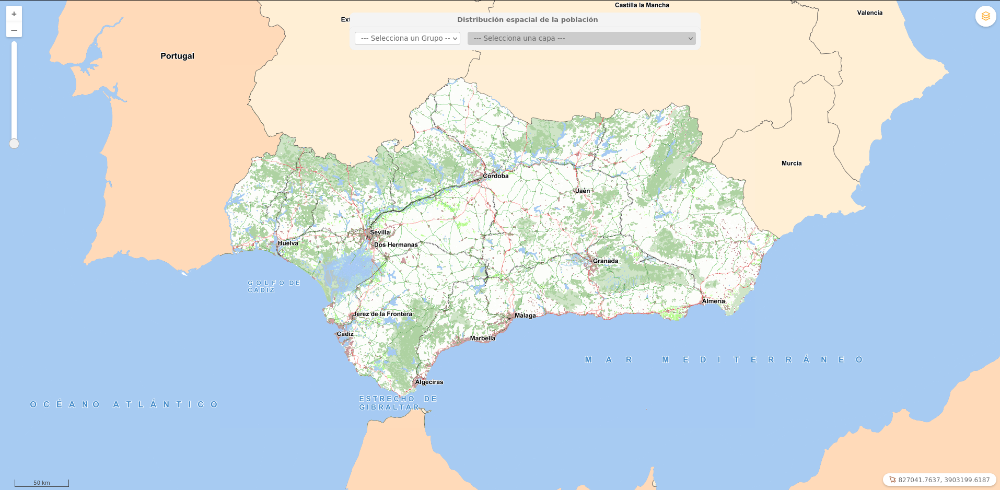

# InputSelectAddLayer

[](https://github.com/sigcorporativo-ja/Mapea4-dev-webpack)

## Descripción

 Plugin de [Mapea](https://github.com/sigcorporativo-ja/Mapea4) para la carga de capas WMS mediante un elemento  html input select

 En función de la configuración suministrada el plugin puede generar cuatro tipo de select:
 
 - ***Select simple:*** Se genera un único input select en el que se listan todos los layers pasados en la configuración
 - ***Select simple con grupos:*** Se genera un único select en el que se lista los layers pasados en la configuración agrupados mediante ***optgroup***.
 - ***Select anidado:*** Se generan dos select de tipo anidado. En función de la opción seleccionada en el primer select se muestran diferentes opciones en el segundo select. 
 - ***Select anidado con grupos:*** Se generan dos select de tipo anidado. En función de la opción seleccionada en el primer select se muestran diferentes opciones en el segundo select agrupados mediante ***optgroup***.



Para el correcto funcionamiento del plugin es necesario pasarle en su constructor un objeto **json** con los parámetros esperados.
### Parámetros del plugin

```javascript
const configOrtofotografias4 = {
  title: 'Ortofotografías de Andalucia',
  label: 'Año',
  group: false,
  data:
  {
    name: 'Año 2016',
    layers: [
      {
        id: 11,
        name: 'ortofotografia_2016_infrarrojo',
        title: 'Ortofotografía Infrarrojo 0,5 metros/pixel (Año 2016)',
        style: 'default',
        url: 'http://www.ideandalucia.es/wms/ortofoto2016?'
      },
      {
        id: 10,
        name: 'ortofotografia_2016_rgb',
        title: 'Ortofotografía Color 0,5 metros/pixel (Año 2016)',
        style: 'default',
        url: 'http://www.ideandalucia.es/wms/ortofoto2016?'
      },
      {
        id: 9,
        name: 'ortofotografia_2016_pancromatico',
        title: 'Ortofotografía Pancromática 0,5 metros/pixel (Año 2016)',
        style: 'default',
        url: 'http://www.ideandalucia.es/wms/ortofoto2016?'
      },
      {
        id: 8,
        name: 'OCA05_2013',
        title: 'Ortofotografía en Color 0,5 metros/pixel (Año 2013)',
        style: 'default',
        url: 'http://www.ideandalucia.es/wms/ortofoto2013?'
      },
      {
        id: 7,
        name: 'OCA10_2010',
        title: 'Ortofotografía en Color 0,5 metros/pixel (Año 2011)',
        style: 'default',
        url: 'http://www.ideandalucia.es/wms/ortofoto2010?'
      }, {
        id: 6,
        name: 'OCA10_2009',
        title: 'Ortofotografía en Color 0,5 metros/pixel (Año 2009)',
        style: 'default',
        url: 'http://www.ideandalucia.es/wms/ortofoto2009?'
      },
      {
        id: 5,
        name: 'ORTO_2007',
        title: 'Ortofotografía en Color 1 metro/pixel (Año 2007)',
        style: 'default',
        url: 'http://www.ideandalucia.es/wms/ortofoto2007?'
      },
      {
        id: 4,
        name: 'ORTO_2004',
        title: 'Ortofotografía en Color 1 metro/pixel (Año 2004)',
        style: 'default',
        url: 'http://www.ideandalucia.es/wms/ortofoto2004?'
      }, {
        id: 3,
        name: 'ORTO_2001',
        title: 'Ortofotografía Pancromática 0,5 metros/pixel  (Año 2001)',
        style: 'default',
        url: 'http://www.ideandalucia.es/wms/ortofoto2001?'
      },
      {
        id: 2,
        name: 'ortofoto1998',
        title: 'Ortofotografía en Color 1 metro/pixel (Año 1998)',
        style: 'default',
        url: 'http://www.ideandalucia.es/wms/ortofoto1998?'
      }, {
        id: 1,
        name: 'REDIAM',
        title: 'Ortofotografía Pancromática 1 metro/pixel (Año 1956)',
        style: 'default',
        url: 'http://www.juntadeandalucia.es/medioambiente/mapwms/REDIAM_Ortofoto_Andalucia_1956?'
      }
    ]
  }
}
```


- **title [string]:** Título del panel. El título aparecerá tanto al dejar el ratón encima del boton del plugin a modo de Tooltip como en la parte superior del panel.
- **geosearchUrl [string]:** url del core de geosearch al cual se desea consultar. La url deberá acabar con el símbolo **?**
- **maxResults [integer]:**  Número máximo de registros que se desea recibir. Esto permite  el número de resultados devueltos facilitando la paginación y los tiempos de respuesta del geosearch
- **fields: [array]** Campos sobre los que se desea buscar.(Array). Listado de campos que se desea que aparezcan en el Panel de buscador para realizar los filtros. Es necesario incluir los siguientes parámetros:

   - ***field:*** Nombre del campo en el core de geosearh
   - ***alias:*** Texto descriptivo del campo
   - ***label:*** Texto a mostar a modo de ayuda 


- **infoFields: [array]** Campos que se desean mostrar una vez optenidos los resultados. El orden de definición de estos afecta al orden de aparición en la tabla resultante.


   - ***field:*** Nombre del campo en el core de geosearh
   - ***alias:*** Texto descriptivo del campo


## Metodos

El plugin cuenta con el método ***getLayer()*** el cual permite obtener el layer que actualmente esta cargado en el mapa mediante este plugin. De esta manera no es necesario hacer uso del metodo ***getLayers()*** del objeto Map

## Eventos 

El plugin expone dos eventos 

- ***M.evt.ADDED_TO_MAP:*** Se dispara cuando se carga el control del plugin 
- ***M.evt.ADDED_WMS:*** Se dispara cuando se carga una capa mediante el plugin

Al exponer el evento ***M.evt.ADDED_WMS*** cada vez que se carga un layer con el plugin es posible saber en cada momento que capa esta actualemente cargada combinando dicho evento con el metodo getLayer() del plugin.

```javascript
const mp = new Inputselectaddlayer(configGridPoblacion);

map.addPlugin(mp);

mp.on(M.evt.ADDED_TO_MAP, () => {
  console.log('se cargo el plugin');
})

mp.on(M.evt.ADDED_WMS, () => {
  console.log('se cargo una capa');
  console.log(mp.getLayer().name)
})
```

## Recursos y configuración

- js: inputselectaddlayer.ol.min.js
- css: inputselectaddlayer.min.css

```javascript

const configGridPoblacion = {
  title: 'Distribución espacial de la población',
  label: 'Año',
  group: true,
  data: [
    {
      name: 'Año 2019',
      layerGroups: [
        {
          group: 'Población',
          layers: [
            {
              id: 1,
              name: 'gridpob_250',
              title: 'Número de habitantes',
              style: 'stl_poblacion_total',
              url: 'http://www.juntadeandalucia.es/institutodeestadisticaycartografia/geoserver-ieca/gridpob/wms?'
            },
            {
              id: 2,
              name: 'gridpob_250',
              title: 'Nº hab. Menores de 16 años',
              style: 'stl_poblacion_edad0015',
              url: 'http://www.juntadeandalucia.es/institutodeestadisticaycartografia/geoserver-ieca/gridpob/wms?'
            },
            {
              id: 3,
              name: 'gridpob_250',
              title: 'Nº hab. De 16 a 64 años',
              style: 'stl_poblacion_edad1664',
              url: 'http://www.juntadeandalucia.es/institutodeestadisticaycartografia/geoserver-ieca/gridpob/wms?'
            },
            {
              id: 4,
              name: 'gridpob_250',
              title: 'Nº hab. Mayores de 64 años',
              style: 'stl_poblacion_edad65_',
              url: 'http://www.juntadeandalucia.es/institutodeestadisticaycartografia/geoserver-ieca/gridpob/wms?'
            }
          ]
        },
        {
          group: 'Afiliados a la Seguridad Social',
          layers: [
            {
              id: 5,
              name: 'gridafil_250',
              title: 'Afiliados a la Seguridad Social',
              style: 'stl_segsoc_total',
              url: 'http://www.juntadeandalucia.es/institutodeestadisticaycartografia/geoserver-ieca/gridafil/wms?'
            },
            {
              id: 6,
              name: 'gridafil_250',
              title: 'Afiliados por cuenta propia',
              style: 'stl_segsoc_rellabprop',
              url: 'http://www.juntadeandalucia.es/institutodeestadisticaycartografia/geoserver-ieca/gridafil/wms?'
            },
            {
              id: 7,
              name: 'gridafil_250',
              title: 'Afiliados por cuenta ajena',
              style: 'stl_segsoc_rellabajen',
              url: 'http://www.juntadeandalucia.es/institutodeestadisticaycartografia/geoserver-ieca/gridafil/wms?'
            }
          ]
        },
        {
          group: 'Pensionistas de la Seguridad Social',
          layers: [
            {
              id: 8,
              name: 'gridpenc_250',
              title: 'Número de Pensionistas',
              style: 'stl_pensiones_total',
              url: 'http://www.juntadeandalucia.es/institutodeestadisticaycartografia/geoserver-ieca/gridpenc/wms?'
            },
            {
              id: 9,
              name: 'gridpenc_250',
              title: 'Pensionistas por jubilación',
              style: 'stl_penc_tipjub',
              url: 'http://www.juntadeandalucia.es/institutodeestadisticaycartografia/geoserver-ieca/gridpenc/wms?'
            },
            {
              id: 10,
              name: 'gridpenc_250',
              title: 'Pensionistas por viudedad',
              style: 'stl_penc_tipviu',
              url: 'http://www.juntadeandalucia.es/institutodeestadisticaycartografia/geoserver-ieca/gridpenc/wms?'
            },
            {
              id: 11,
              name: 'gridpenc_250',
              title: 'Pensionistas por jubilación y viudedad',
              style: 'stl_penc_tipjyv',
              url: 'http://www.juntadeandalucia.es/institutodeestadisticaycartografia/geoserver-ieca/gridpenc/wms?'
            },
            {
              id: 12,
              name: 'gridpenc_250',
              title: 'Pensionistas por incapacidad',
              style: 'stl_penc_tipinc',
              url: 'http://www.juntadeandalucia.es/institutodeestadisticaycartografia/geoserver-ieca/gridpenc/wms?'
            },
            {
              id: 13,
              name: 'gridpenc_250',
              title: 'Otro tipo de pensionistas',
              style: 'stl_penc_tipotr',
              url: 'http://www.juntadeandalucia.es/institutodeestadisticaycartografia/geoserver-ieca/gridpenc/wms?'
            }
          ]
        }
      ]
    },
    {
      name: 'Año 2018',
      layerGroups: [
        {
          group: 'Población',
          layers: [
            {
              id: 14,
              name: 'gridpob18_250',
              title: 'Número de habitantes',
              style: 'stl_poblacion_total',
              url: 'http://www.juntadeandalucia.es/institutodeestadisticaycartografia/geoserver-ieca/gridpob2018/wms?'
            },
            {
              id: 15,
              name: 'gridpob18_250',
              title: 'Nº hab. Menores de 16 años',
              style: 'stl_poblacion_edad0015',
              url: 'http://www.juntadeandalucia.es/institutodeestadisticaycartografia/geoserver-ieca/gridpob2018/wms?'
            },
            {
              id: 16,
              name: 'gridpob18_250',
              title: 'Nº hab. De 16 a 64 años',
              style: 'stl_poblacion_edad1664',
              url: 'http://www.juntadeandalucia.es/institutodeestadisticaycartografia/geoserver-ieca/gridpob2018/wms?'
            },
            {
              id: 17,
              name: 'gridpob18_250',
              title: 'Nº hab. Mayores de 64 años',
              style: 'stl_poblacion_edad65_',
              url: 'http://www.juntadeandalucia.es/institutodeestadisticaycartografia/geoserver-ieca/gridpob2018/wms?'
            }
          ]
        },
        {
          group: 'Afiliados a la Seguridad Social',
          layers: [
            {
              id: 18,
              name: 'gridafil18_250',
              title: 'Afiliados a la Seguridad Social',
              style: 'stl_segsoc_total',
              url: 'http://www.juntadeandalucia.es/institutodeestadisticaycartografia/geoserver-ieca/gridafil2018/wms?'
            },
            {
              id: 19,
              name: 'gridafil18_250',
              title: 'Afiliados por cuenta propia',
              style: 'stl_segsoc_rellabprop',
              url: 'http://www.juntadeandalucia.es/institutodeestadisticaycartografia/geoserver-ieca/gridafil2018/wms?'
            },
            {
              id: 20,
              name: 'gridafil18_250',
              title: 'Afiliados por cuenta ajena',
              style: 'stl_segsoc_rellabajen',
              url: 'http://www.juntadeandalucia.es/institutodeestadisticaycartografia/geoserver-ieca/gridafil2018/wms?'
            }
          ]
        },
        {
          group: 'Pensionistas de la Seguridad Social',
          layers: [
            {
              id: 21,
              name: 'gridpenc18_250',
              title: 'Número de Pensionistas',
              style: 'stl_pensiones_total',
              url: 'http://www.juntadeandalucia.es/institutodeestadisticaycartografia/geoserver-ieca/gridpenc2018/wms?'
            },
            {
              id: 22,
              name: 'gridpenc18_250',
              title: 'Pensionistas por jubilación',
              style: 'stl_penc_tipjub',
              url: 'http://www.juntadeandalucia.es/institutodeestadisticaycartografia/geoserver-ieca/gridpenc2018/wms?'
            },
            {
              id: 23,
              name: 'gridpenc18_250',
              title: 'Pensionistas por viudedad',
              style: 'stl_penc_tipviu',
              url: 'http://www.juntadeandalucia.es/institutodeestadisticaycartografia/geoserver-ieca/gridpenc2018/wms?'
            },
            {
              id: 24,
              name: 'gridpenc18_250',
              title: 'Pensionistas por jubilación y viudedad',
              style: 'stl_penc_tipjyv',
              url: 'http://www.juntadeandalucia.es/institutodeestadisticaycartografia/geoserver-ieca/gridpenc2018/wms?'
            },
            {
              id: 25,
              name: 'gridpenc18_250',
              title: 'Pensionistas por incapacidad',
              style: 'stl_penc_tipinc',
              url: 'http://www.juntadeandalucia.es/institutodeestadisticaycartografia/geoserver-ieca/gridpenc2018/wms?'
            },
            {
              id: 26,
              name: 'gridpenc18_250',
              title: 'Otro tipo de pensionistas',
              style: 'stl_penc_tipotr',
              url: 'http://www.juntadeandalucia.es/institutodeestadisticaycartografia/geoserver-ieca/gridpenc2018/wms?'
            }
          ]
        }
      ]
    },
    {
      name: 'Año 2017',
      layerGroups: [
        {
          group: 'Población',
          layers: [
            {
              id: 27,
              name: 'gridpob17_250',
              title: 'Número de habitantes',
              style: 'stl_poblacion_total',
              url: 'http://www.juntadeandalucia.es/institutodeestadisticaycartografia/geoserver-ieca/gridpob2017/wms?'
            },
            {
              id: 28,
              name: 'gridpob17_250',
              title: 'Nº hab. Menores de 16 años',
              style: 'stl_poblacion_edad0015',
              url: 'http://www.juntadeandalucia.es/institutodeestadisticaycartografia/geoserver-ieca/gridpob2017/wms?'
            },
            {
              id: 29,
              name: 'gridpob17_250',
              title: 'Nº hab. De 16 a 64 años',
              style: 'stl_poblacion_edad1664',
              url: 'http://www.juntadeandalucia.es/institutodeestadisticaycartografia/geoserver-ieca/gridpob2017/wms?'
            },
            {
              id: 30,
              name: 'gridpob17_250',
              title: 'Nº hab. Mayores de 64 años',
              style: 'stl_poblacion_edad65_',
              url: 'http://www.juntadeandalucia.es/institutodeestadisticaycartografia/geoserver-ieca/gridpob2017/wms?'
            }
          ]
        },
        {
          group: 'Afiliados a la Seguridad Social',
          layers: [
            {
              id: 31,
              name: 'gridafil17_250',
              title: 'Afiliados a la Seguridad Social',
              style: 'stl_segsoc_total',
              url: 'http://www.juntadeandalucia.es/institutodeestadisticaycartografia/geoserver-ieca/gridafil2017/wms?'
            },
            {
              id: 32,
              name: 'gridafil17_250',
              title: 'Afiliados por cuenta propia',
              style: 'stl_segsoc_rellabprop',
              url: 'http://www.juntadeandalucia.es/institutodeestadisticaycartografia/geoserver-ieca/gridafil2017/wms?'
            },
            {
              id: 33,
              name: 'gridafil17_250',
              title: 'Afiliados por cuenta ajena',
              style: 'stl_segsoc_rellabajen',
              url: 'http://www.juntadeandalucia.es/institutodeestadisticaycartografia/geoserver-ieca/gridafil2017/wms?'
            }
          ]
        },
        {
          group: 'Pensionistas de la Seguridad Social',
          layers: [
            {
              id: 34,
              name: 'gridpenc17_250',
              title: 'Número de Pensionistas',
              style: 'stl_pensiones_total',
              url: 'http://www.juntadeandalucia.es/institutodeestadisticaycartografia/geoserver-ieca/gridpenc2017/wms?'
            },
            {
              id: 35,
              name: 'gridpenc17_250',
              title: 'Pensionistas por jubilación',
              style: 'stl_penc_tipjub',
              url: 'http://www.juntadeandalucia.es/institutodeestadisticaycartografia/geoserver-ieca/gridpenc2017/wms?'
            },
            {
              id: 36,
              name: 'gridpenc17_250',
              title: 'Pensionistas por viudedad',
              style: 'stl_penc_tipviu',
              url: 'http://www.juntadeandalucia.es/institutodeestadisticaycartografia/geoserver-ieca/gridpenc2017/wms?'
            },
            {
              id: 37,
              name: 'gridpenc17_250',
              title: 'Pensionistas por jubilación y viudedad',
              style: 'stl_penc_tipjyv',
              url: 'http://www.juntadeandalucia.es/institutodeestadisticaycartografia/geoserver-ieca/gridpenc2017/wms?'
            },
            {
              id: 38,
              name: 'gridpenc17_250',
              title: 'Pensionistas por incapacidad',
              style: 'stl_penc_tipinc',
              url: 'http://www.juntadeandalucia.es/institutodeestadisticaycartografia/geoserver-ieca/gridpenc2017/wms?'
            },
            {
              id: 39,
              name: 'gridpenc17_250',
              title: 'Otro tipo de pensionistas',
              style: 'stl_penc_tipotr',
              url: 'http://www.juntadeandalucia.es/institutodeestadisticaycartografia/geoserver-ieca/gridpenc2017/wms?'
            }
          ]
        }
      ]
    },
    {
      name: 'Año 2016',
      layerGroups: [
        {
          group: 'Población',
          layers: [
            {
              id: 40,
              name: 'gridpob16_250',
              title: 'Número de habitantes',
              style: 'stl_poblacion_total',
              url: 'http://www.juntadeandalucia.es/institutodeestadisticaycartografia/geoserver-ieca/gridpob2016/wms?'
            },
            {
              id: 41,
              name: 'gridpob16_250',
              title: 'Nº hab. Menores de 16 años',
              style: 'stl_poblacion_edad0015',
              url: 'http://www.juntadeandalucia.es/institutodeestadisticaycartografia/geoserver-ieca/gridpob2016/wms?'
            },
            {
              id: 42,
              name: 'gridpob16_250',
              title: 'Nº hab. De 16 a 64 años',
              style: 'stl_poblacion_edad1664',
              url: 'http://www.juntadeandalucia.es/institutodeestadisticaycartografia/geoserver-ieca/gridpob2016/wms?'
            },
            {
              id: 43,
              name: 'gridpob16_250',
              title: 'Nº hab. Mayores de 64 años',
              style: 'stl_poblacion_edad65_',
              url: 'http://www.juntadeandalucia.es/institutodeestadisticaycartografia/geoserver-ieca/gridpob2016/wms?'
            }
          ]
        },
        {
          group: 'Afiliados a la Seguridad Social',
          layers: [
            {
              id: 44,
              name: 'gridafil16_250',
              title: 'Afiliados a la Seguridad Social',
              style: 'stl_segsoc_total',
              url: 'http://www.juntadeandalucia.es/institutodeestadisticaycartografia/geoserver-ieca/gridafil2016/wms?'
            },
            {
              id: 45,
              name: 'gridafil16_250',
              title: 'Afiliados por cuenta propia',
              style: 'stl_segsoc_rellabprop',
              url: 'http://www.juntadeandalucia.es/institutodeestadisticaycartografia/geoserver-ieca/gridafil2016/wms?'
            },
            {
              id: 46,
              name: 'gridafil16_250',
              title: 'Afiliados por cuenta ajena',
              style: 'stl_segsoc_rellabajen',
              url: 'http://www.juntadeandalucia.es/institutodeestadisticaycartografia/geoserver-ieca/gridafil2016/wms?'
            }
          ]
        },
        {
          group: 'Pensionistas de la Seguridad Social',
          layers: [
            {
              id: 47,
              name: 'gridpenc16_250',
              title: 'Número de Pensionistas',
              style: 'stl_pensiones_total',
              url: 'http://www.juntadeandalucia.es/institutodeestadisticaycartografia/geoserver-ieca/gridpenc2016/wms?'
            },
            {
              id: 48,
              name: 'gridpenc16_250',
              title: 'Pensionistas por jubilación',
              style: 'stl_penc_tipjub',
              url: 'http://www.juntadeandalucia.es/institutodeestadisticaycartografia/geoserver-ieca/gridpenc2016/wms?'
            },
            {
              id: 49,
              name: 'gridpenc16_250',
              title: 'Pensionistas por viudedad',
              style: 'stl_penc_tipviu',
              url: 'http://www.juntadeandalucia.es/institutodeestadisticaycartografia/geoserver-ieca/gridpenc2016/wms?'
            },
            {
              id: 50,
              name: 'gridpenc16_250',
              title: 'Pensionistas por jubilación y viudedad',
              style: 'stl_penc_tipjyv',
              url: 'http://www.juntadeandalucia.es/institutodeestadisticaycartografia/geoserver-ieca/gridpenc2016/wms?'
            },
            {
              id: 51,
              name: 'gridpenc16_250',
              title: 'Pensionistas por incapacidad',
              style: 'stl_penc_tipinc',
              url: 'http://www.juntadeandalucia.es/institutodeestadisticaycartografia/geoserver-ieca/gridpenc2016/wms?'
            },
            {
              id: 52,
              name: 'gridpenc16_250',
              title: 'Otro tipo de pensionistas',
              style: 'stl_penc_tipotr',
              url: 'http://www.juntadeandalucia.es/institutodeestadisticaycartografia/geoserver-ieca/gridpenc2016/wms?'
            }
          ]
        }
      ]
    }
  ]
}


const mp = new Inputselectaddlayer(configGridPoblacion);

map.addPlugin(mp);

mp.on(M.evt.ADDED_TO_MAP, () => {
  console.log('se cargo el plugin');
})

mp.on(M.evt.ADDED_WMS, () => {
  console.log('se cargo una capa');
  console.log(mp.getLayer().name)
})
```

## Video Demo

Para comprobar el funcionamiento de este plugin se puede descargar el [Video](https://github.com/emiliopardo/inputselectaddlayer/blob/master/docs/video/inputselectaddlayer.webm?raw=true) el cual contempla la configuración y carga del plugin con diferentes geosearch